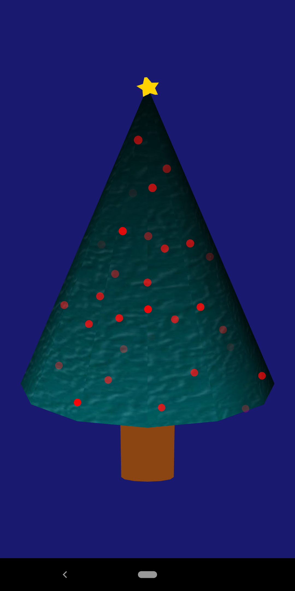

# Delphi Christmas Tree

Quick and simple (and crude-looking) Christmas tree app made using standard Delphi components. Written in Delphi 11 but likely works with several of the last versions of Delphi.

The .dproj file was left out purposefully to allow others to define their own icons and version info and whatnot. The basics to get this going in your Delphi environement are here.

This project was extracted from a tutorial app accompanying chapter 8 ("Exploring the World of 3D") from the book, [Fearless Cross-Platform Development with Delphi](https://github.com/PacktPublishing/Fearless-Cross-Platform-Development-with-Delphi). 

Here's a screenshot of this running on an Android phone: 

